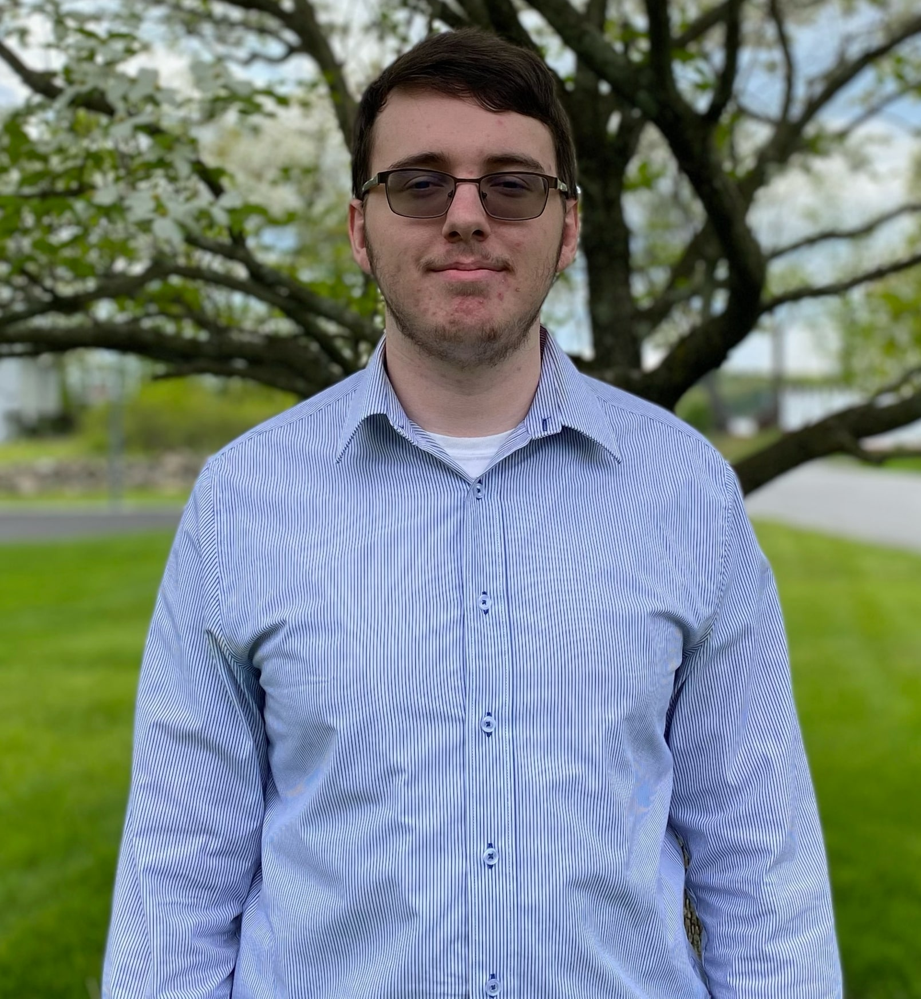

Andrew McDonald

      I have been learning about Computer Science related topics for about 5.5 years and for the last 2.5 years of that I have focused on Web Development. I am currently pursuing my undergraduate degree here at New Paltz and plan to pursue my graduate degree as well. When it comes to projects I have completed, for the Software Engineering course, my team members and I successfully created a web application intended for use with the engineering department where it would schedule a whole department’s classes based on co-reqs and pre-reqs. Although this application has not been truly completed it has gotten to a point where it functions well. This project was almost entirely PHP server-side and for the client had REST API created with PHP that was then read into Typescript which is the language I mainly worked with when creating the front-end experience. I mainly used JQuery for this project. Another project I am just finishing up is for a client where my friend and I created a Full-Stack web application with React, NEXTJS, Typescript, URQL, GraphQL, PostgreSQL, TypeORM, and Express. There are also a bunch of minor projects I have done learning all different types of web technologies.

      The main thing I wish to get from this class is not quite a method of being able to create a Full-Stack web application but instead to reinforce my skill of making quality web applications. I am quite excited for this course as it is in a field I know a good bit about and serves to teach me a lot I am unaware of. Finally, using GraphQL with a strong structure as opposed to the ad-hawk way I have done it in the past looks promising.
